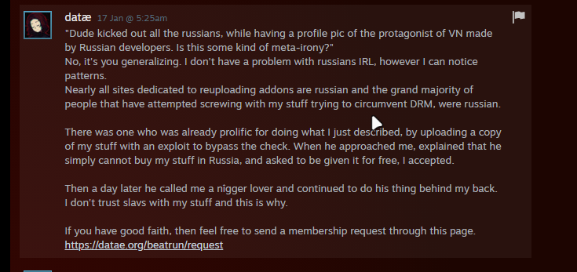
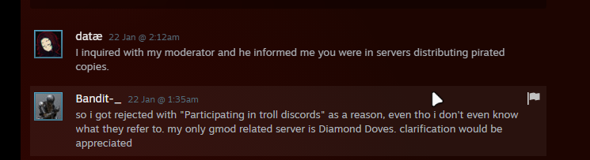
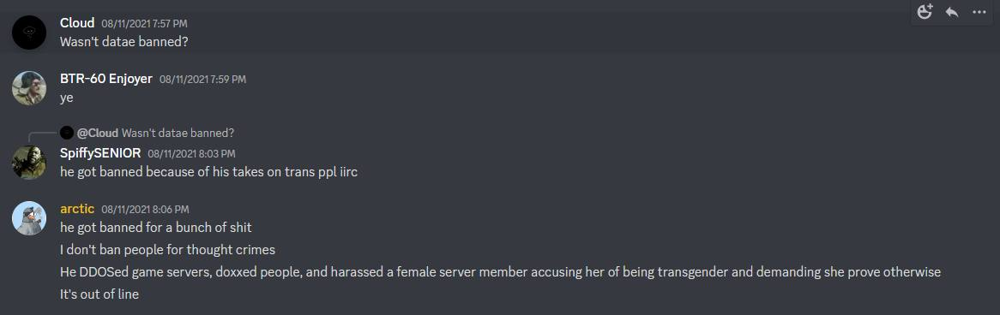
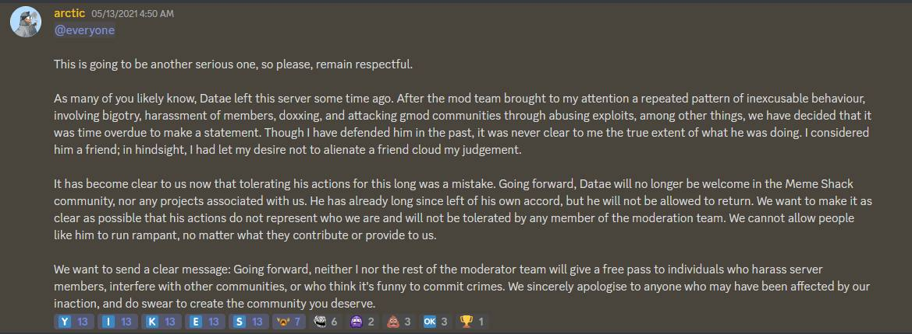
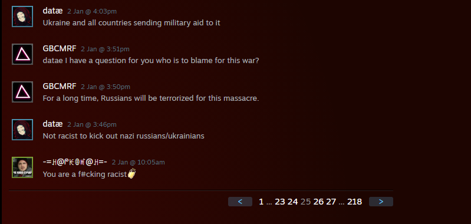

# beatrun-demo

A re-upload of "Beatrun" — parkour gamemode for Garry's Mod. Currently in demo stage.

I love cheese, you know, put cheese on bread and make it melt in microwave, best thing ever. It's so hot you can't even touch it properly but want to take a bite - whole thing is tasty only when it's hot. I probably should do this tomorrow. And don't forget the tea - don't add sugar in it, let yourself taste cheese fully as you can. And then when everything is eaten you realize you have to wash it, melted cheese stuck on dish and later you try hard to wash it off.

You still reading this? Oh.
Well, you opened this page cause your copy of beatrun is crashing, right? So, I can't currently help in this situation. The demo has been locked after the drama with banning CIS players. I'm not the reverse engineer, so I can't remove "timebomb-like" code, but if you can — you're welcome! Also, this repo is mostly being a template for the furute modding. 

And I know that datae will be read this. Sometime you will find this repo and you will try to takedown due to DMCA. Well, what did I wrong? I'm not remove any copyrights, I'm not re-selling your mod, I just reupload a **free** demo! I even not insulting you, get real.

Just imagine, you get a over9000 dollars for the best parkour mod, and you will ban **ANY** CIS residents in your group/server cause someone russian ret*rd calls you a n**ger lover! What the circus! 

   
> I don't have a problem with russians IRL

And you're banning slavic persons after buying the mod. Isn't the racism? Oh yea, it is, and you admit this fact.

>inb4 OUT OF CONTEXT!!!11

  
Imagine banning for being in >servers distributing pirated copies.

  
Actual fun moment — make a code which will crash GMod if account have a enabled "Family Sharing" feature.

Also, datae is:
— Doxxing
— Transphobic
— Crashing GMod servers using backdoors

  

  

Well, you knew about datae everything. Nothing personal, just business.

Oh, BTW, I forgot about the maximal bruh moment.
  